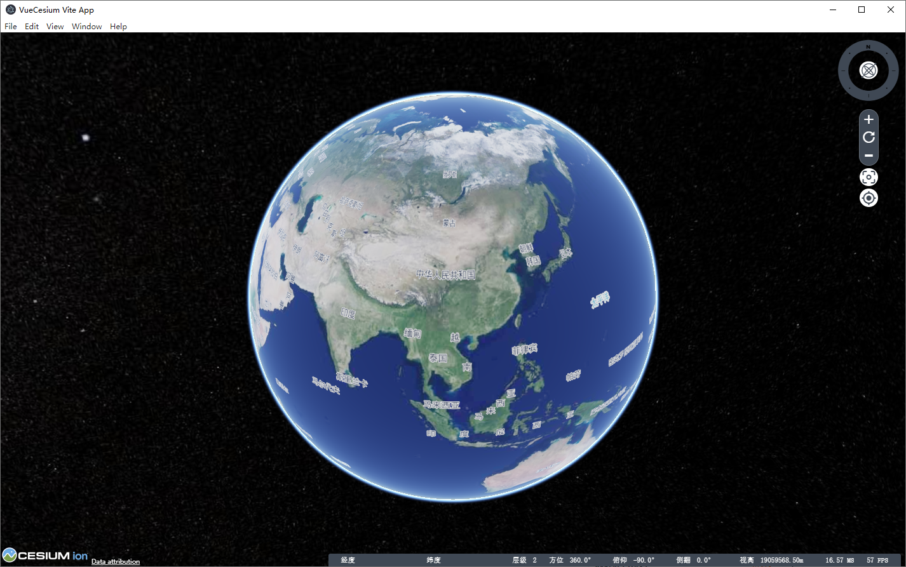

# vue-cesium-electron-vite-starter

`Electron` + `Vue3` + `Vite2` integration

## How and Why
- `Vite` is the scaffold of the future

## Command
- yarn dev
- yarn run build

## Note
- In the development environment, we need to transform the `Electron` related API into commonjs
- And you can only use ESM
- Fork from [electron-vue-vite](https://github.com/caoxiemeihao/electron-vue-vite)

## License

[MIT License](https://opensource.org/licenses/MIT)
